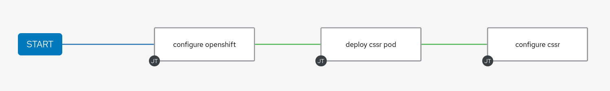

ansible-cssr-ocp
=========

Deploy CSSR instance into OpenShift.

Variables
--------------

The following variables can be overriden.

| Name                    | Default value         |                                                                                  |
|-------------------------|-----------------------|----------------------------------------------------------------------------------|
| cssr_namespace          |                       | OpenShift namespace                                                              |
| cssr_network_attachments|                       | Network attachments to be created in the OpenShift namespace                     |
| cssr_name               |                       | Name of the CSSR Node                                                            |
| cssr_routername         |                       | Name of CSSR Router                                                              |
| cssr_conductor_ip       |                       | CSSR Conductor IP or hostname                                                    |
| cssr_conductor_user     |                       | CSSR Conductor Username                                                          |
| cssr_conductor_password |                       | CSSR Conductor Password                                                          |


Example variables
--------------

Example variables can be found in the example_vars.yml file.

Running the playbook from the CLI
--------------

ansible-playbook -e @example_vars.yml site.yml

Running the playbooks from automation controller
--------------

Individual playbooks can be built into a workflow in automation controller. 



Custom credentials in automation controller.
--------------

Two custom credential types can be added into automation controller.

To create the custom credential for CSSR conductor, use the following structure within AAP.

Input Configuration:

```bash
fields:
  - id: cssr_conductor_ip
    type: string
    label: cssr conductor hostname or ip
  - id: cssr_conductor_user
    type: string
    label: cssr conductor username
  - id: cssr_conductor_password
    type: string
    label: cssr conductor password
    secret: true
```

Injector Configuration:

```bash
extra_vars:
  cssr_conductor_ip: '{{ cssr_conductor_ip }}'
  cssr_conductor_user: '{{ cssr_conductor_user }}'
  cssr_conductor_password: '{{ cssr_conductor_password }}'
```

To create the custom credential for the node admin password, use the following structure within AAP.

Input Configuration:

```bash
fields:
  - id: cssr_node_password
    type: string
    label: cssr node password
    secret: true
  - id: cssr_node_salt
    type: string
    label: cssr node salt
    secret: true
```

Injector Configuration:

```bash
extra_vars:
  cssr_node_salt: '{{ cssr_node_salt }}'
  cssr_node_password: '{{ cssr_node_password }}'
```

OpenShift credential
--------------

A credential is required to authenticate to OpenShift to create the namespace, network attachments and statefulset. Here is an example for configuring a service account. In production you would want to limit the access more than cluster-admin.

Create the serviceaccount and assign the required role:

```
oc create serviceaccount aap-sa
oc adm policy add-cluster-role-to-user cluster-admin -z aap-sa 
```

Find the token associated to the serviceaccount:

```
oc get sa aap-sa -o yaml
apiVersion: v1
imagePullSecrets:
- name: aap-sa-dockercfg-sgh2s
kind: ServiceAccount
metadata:
  creationTimestamp: "2023-03-30T12:51:17Z"
  name: aap-sa
  namespace: cssr-auto
  resourceVersion: "207262113"
  uid: e6a210bd-cf4c-4441-996a-fa2be40cf235
secrets:
- name: aap-sa-token-pggr9
- name: aap-sa-dockercfg-sgh2s
```

Get the token:

```
oc describe secret aap-sa-token-pggr9
```
